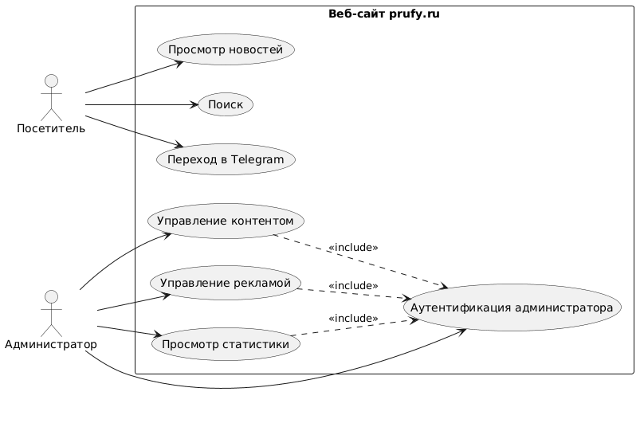

# Отчёт по лабораторной работе
## «Разработка требований к веб-сайту (SRS)»

### Вариант №408652  
**Сайт:** [prufy.ru](https://prufy.ru/)

---

## Software Requirements Specification (SRS)

### 1. Введение

#### 1.1. Цель документа
Документ содержит перечень требований к разрабатываемому веб-сайту, структурированных по категориям методологии RUP (Rational Unified Process). Публичная регистрация пользователей отсутствует; взаимодействие с посетителями осуществляется через Telegram.

#### 1.2 Область применения
Новостной интернет-портал, предоставляющий посетителям доступ к актуальным новостям (просмотр, поиск) и возможность связаться с редакцией через Telegram. Административная часть включает управление контентом, рекламой и аналитику.

---

### 2. Общее описание

#### 2.1 Перспективы продукта
Новостной портал, не требующий регистрации для просмотра контента. Взаимодействие с редакцией вынесено в Telegram. Администратор управляет публикациями, рекламой и аналитикой через защищённую панель.

#### 2.2 Функциональные возможности
**Посетитель:** просмотр ленты, детальный просмотр, поиск, переход в Telegram.
**Администратор:** аутентификация, управление контентом, управление рекламой, просмотр статистики.

#### 2.3 Характеристики пользователей
**Посетитель:**	Любой пользователь без аутентификации
**Администратор:**	Назначенное лицо с доступом в админ-панель

#### 2.4 Ограничения
*Поддержка ≥ 1000 одновременных посетителей.
*Адаптивный дизайн.
*Время отклика < 2 сек.
*Защита от OWASP Top 10, HTTPS.
*Двухфакторная аутентификация для администратора (рекомендовано).

---

### 3.Требования  
## 3. Спецификация требований

### 3.1. Функциональные требования (FR)

| ID | Название | Формулировка требования | Приоритет | Риск | Стабильность | Часы |
|----|----------|-------------------------|-----------|------|--------------|------|
| **FR-01** | Просмотр новостной ленты | Система должна отображать на главной странице ленту новостей с пагинацией (постраничным выводом). Каждая карточка новости должна содержать заголовок, дату публикации, имя автора, краткое описание (первые 100-150 символов) и ссылку для перехода к полной версии. Должна быть возможность фильтрации ленты по категориям и по дате публикации. | Высокий | Низкий | Высокая | 40 |
| **FR-02** | Просмотр полной новости | Система должна предоставлять возможность перехода по ссылке из ленты на страницу с полной версией новости. На странице должны отображаться заголовок, дата публикации, имя автора, текст новости, изображения (если прикреплены), а также счётчик просмотров, который увеличивается при каждом открытии. | Высокий | Низкий | Высокая | 24 |
| **FR-03** | Поиск по сайту | Система должна обеспечивать полнотекстовый поиск по заголовкам и тексту новостей. Поиск должен выполняться по ключевым словам, введённым пользователем в специальное поле. Результаты должны отображаться на отдельной странице, ранжированные по релевантности, с указанием заголовка, фрагмента текста с выделенными ключевыми словами, даты публикации. | Средний | Средний | Средняя | 56 |
| **FR-04** | Управление новостями (админ-панель) | Система должна предоставлять администратору защищённый интерфейс для выполнения операций создания, просмотра, редактирования и удаления новостей. Форма создания и редактирования должна содержать поля: заголовок, текст (с визуальным редактором WYSIWYG), дата публикации, автор, категория (выпадающий список), загрузка изображений. Должна быть предусмотрена валидация вводимых данных (заполнение обязательных полей, корректность даты). | Высокий | Средний | Высокая | 80 |
| **FR-05** | Управление категориями (админ-панель) | Система должна предоставлять администратору интерфейс для управления категориями новостей: создание, редактирование и удаление категорий. При удалении категории система должна проверять, есть ли новости, привязанные к ней, и предлагать переназначить их в другую категорию или предупреждать о невозможности удаления. | Средний | Низкий | Высокая | 24 |
| **FR-06** | Управление рекламными местами (админ-панель) | Система должна предоставлять администратору возможность настраивать отображение рекламных баннеров в заданных позициях (шапка, сайдбар, внутри статьи). Для каждого рекламного блока можно указать период показа (даты начала и окончания), код баннера (HTML/JavaScript), приоритет показа. Система должна автоматически отображать активные блоки в соответствии с настройками. | Средний | Средний | Средняя | 60 |
| **FR-07** | Аналитика (админ-панель) | Система должна предоставлять администратору панель статистики с отображением количества просмотров новостей (в разрезе по новостям и категориям), источников трафика (рефереры), количества уникальных посетителей за период. Данные должны быть доступны в виде графиков и таблиц, с возможностью экспорта в CSV. | Высокий | Средний | Средняя | 64 |
| **FR-08** | Интеграция с Telegram | Система должна отображать на всех страницах сайта иконку-ссылку на Telegram-канал (или чат-бот) для связи с редакцией. Ссылка должна вести на внешний ресурс (URL настраивается администратором в панели управления). | Низкий | Низкий | Высокая | 4 |

---

### 3.2. Требования к удобству использования (UR)

| ID | Название | Формулировка требования | Приоритет | Риск | Часы |
|----|----------|-------------------------|-----------|------|------|
| **UR-01** | Адаптивный дизайн | Система должна иметь адаптивный веб-дизайн, обеспечивающий корректное отображение и удобство использования на всех типах устройств: настольных компьютерах, ноутбуках, планшетах и смартфонах. Интерфейс должен автоматически подстраиваться под ширину экрана, изменяя расположение элементов, размер шрифтов и способы навигации. На мобильных устройствах меню должно трансформироваться в выпадающее или «бургер-меню». | Высокий | Низкий | 48 |
| **UR-02** | Интуитивно понятная навигация | Навигация по сайту должна быть простой и предсказуемой. Основные разделы сайта (главная, категории, поиск) должны быть доступны из главного меню, расположенного в верхней части каждой страницы. На страницах новостей должно присутствовать навигационное средство «хлебные крошки», показывающее путь пользователя по сайту и позволяющее вернуться на уровень выше. Все ссылки и кнопки должны иметь понятные названия и при наведении визуально выделяться. | Высокий | Низкий | 32 |
| **UR-03** | Скорость загрузки страниц | Время загрузки главной страницы и страницы новости при средней скорости интернет-соединения (10 Мбит/с) не должно превышать 2 секунд для 95% запросов. Для обеспечения этого требования необходимо оптимизировать изображения, минимизировать CSS/JS, использовать кэширование на стороне браузера и сервера, а также CDN для статического контента. | Высокий | Средний | 40 |
| **UR-04** | Доступность (Accessibility) | Система должна соответствовать требованиям WCAG 2.1 уровня A: обеспечивать достаточную контрастность текста, навигацию с клавиатуры, наличие alt-атрибутов для изображений. Интерфейс должен быть доступен для пользователей с ограниченными возможностями (например, с нарушениями зрения). | Средний | Средний | 36 |
| **UR-05** | Понятные сообщения об ошибках | В случае возникновения ошибок система должна выводить пользователю понятные, информативные сообщения на русском языке, объясняющие причину проблемы и предлагающие возможные пути её решения. Например, при поиске без результатов: «По вашему запросу ничего не найдено. Попробуйте изменить запрос». При недоступности страницы: «Запрашиваемая страница не найдена». Сообщения об ошибках должны быть оформлены в едином стиле и не содержать технических деталей. | Средний | Низкий | 16 |

---

### 3.3. Требования к надёжности (RL)

| ID | Название | Формулировка требования | Приоритет | Риск | Часы |
|----|----------|-------------------------|-----------|------|------|
| **RL-01** | Доступность системы | Система должна быть доступна для пользователей не менее 99.5% времени в течение месяца (суммарное время недоступности не более 3.5 часов в месяц). Для обеспечения этого требования необходимо использовать надёжного хостинг-провайдера, настроить мониторинг доступности с оповещением администратора о сбоях, предусмотреть возможность быстрого переключения на резервное оборудование. | Высокий | Средний | 48 |
| **RL-02** | Сохранность данных | Система должна обеспечивать сохранность всего контента и данных администраторов. Должен быть настроен механизм регулярного автоматического резервного копирования базы данных и загруженных файлов. Резервные копии должны создаваться ежедневно и храниться не менее 7 дней на отдельном носителе или в облачном хранилище. Должна быть предусмотрена возможность ручного запуска резервного копирования. | Высокий | Средний | 32 |
| **RL-03** | Восстановление после сбоя | Время восстановления полной работоспособности системы после критического сбоя не должно превышать 2 часов. Для этого необходимо иметь задокументированную процедуру восстановления, регулярно обновляемые резервные копии и возможность быстрого развёртывания системы на новом сервере. | Средний | Средний | 24 |
| **RL-04** | Защита от взломов | Система должна быть защищена от наиболее распространённых типов веб-уязвимостей. Должна быть обеспечена защита от SQL-инъекций путём использования параметризованных запросов или ORM. Защита от XSS-атак должна реализовываться через экранирование всех выводимых на страницы пользовательских данных. Для защиты от CSRF-атак необходимо использовать специальные токены во всех формах. Доступ к административной панели должен быть только по протоколу HTTPS. Пароли администраторов должны храниться в базе данных в захэшированном виде с использованием стойкого алгоритма (bcrypt). | Высокий | Высокий | 72 |

---

### 3.4. Требования к производительности (PF)

| ID | Название | Формулировка требования | Приоритет | Риск | Часы |
|----|----------|-------------------------|-----------|------|------|
| **PF-01** | Устойчивость к нагрузкам | Система должна стабильно работать при пиковой нагрузке до 1000 одновременных посетителей без критического падения производительности. Время ответа сервера при штатной нагрузке не должно превышать 500 мс для 95% запросов. Для обеспечения этого требования необходимо использовать кэширование часто запрашиваемых данных, оптимизировать запросы к базе данных, настроить балансировку нагрузки при необходимости. | Высокий | Высокий | 80 |
| **PF-02** | Скорость поиска | Время выполнения поискового запроса и отображения результатов не должно превышать 2 секунд при средней нагрузке. Для этого необходимо правильно настроить полнотекстовый поиск в базе данных, использовать индексы, а также кэшировать результаты для часто повторяющихся запросов. | Средний | Средний | 24 |

---

### 3.5. Ограничения разработки (DC)

| ID | Название | Формулировка требования |
|----|----------|-------------------------|
| **DC-01** | Технологический стек | Разработка серверной части должна вестись на языке PHP версии 8.0 или выше. В качестве системы управления базами данных должна использоваться MySQL версии 8.0 или выше. Для клиентской части должны использоваться HTML5, CSS3 и JavaScript (ES6+). |
| **DC-02** | Адаптивная вёрстка | Все веб-страницы должны быть сверстаны с использованием подхода «mobile-first», обеспечивающего корректное отображение на любых устройствах. Вёрстка должна быть резиновой и адаптироваться к контрольным точкам для основных разрешений экранов: мобильные устройства (360px – 480px), планшеты (768px – 1024px), десктопы (1280px и выше). |
| **DC-03** | Стандарты кодирования | Исходный код должен соответствовать стандартам PSR-12 для PHP и общепринятым стандартам для JavaScript и CSS. Код должен быть читаемым, содержать комментарии к сложным участкам и следовать принципам объектно-ориентированного программирования. |
| **DC-04** | Безопасность соединений | Все соединения между браузером пользователя и сервером должны осуществляться исключительно по защищённому протоколу HTTPS. Необходимо настроить автоматическое перенаправление с HTTP на HTTPS для всех запросов. |

---

### 3.6. Риски проекта

| Риск | Описание | Вероятность | Влияние | Приоритет | Меры по снижению риска |
|------|----------|-------------|--------|-----------|------------------------|
| **R-01** | Неполное понимание требований | Средняя | Высокое | 4 | Проведение дополнительных встреч с заказчиком; создание прототипов; регулярная ревизия SRS. |
| **R-02** | Техническая сложность (поиск, производительность) | Средняя | Высокое | 4 | Исследование поисковых движков; нагрузочное тестирование на ранних этапах; оптимизация запросов. |
| **R-03** | Уязвимости безопасности админ-панели | Средняя | Высокое | 5 | Регулярный аудит кода; использование защищённых фреймворков; двухфакторная аутентификация. |
| **R-04** | Изменение требований в процессе | Высокая | Среднее | 5 | Внедрение формального процесса управления изменениями; гибкая архитектура; частые итерации. |
| **R-05** | Недостаток квалифицированных специалистов | Низкая | Высокое | 3 | Планирование найма заранее; аутсорсинг узких специалистов (DevOps, безопасность). |
| **R-06** | Сбои в работе внешних сервисов (CDN, Telegram) | Низкая | Среднее | 2 | Резервирование; реализация graceful degradation (сообщения об ошибках, запасные варианты). |

### 4. UseCase-диаграмма 

**Акторы:**
* **Посетитель** – любой пользователь без аутентификации.
* **Администратор** – владелец или назначенное лицо с доступом в защищенную панель управления.

**Прецеденты использования:**
1. **Просмотр новостей** – лента, фильтрация, детальная страница.
2. **Поиск** – поиск по контенту.
3. **Переход в Telegram** – нажатие на иконку приводит к внешнему ресурсу.
4. **Аутентификация администратора** – вход в админ-панель.
5. **Управление контентом** – создание, редактирование, удаление новостей, категорий, изображений.
6. **Управление рекламой**– настройка рекламных блоков.
7. **Просмотр статистики** – аналитика посещений.

---

### 5. Оценка трудозатрат

| Категория            | Часы |
|----------------------|------|
| Функциональные (F)   | 264  |
| Пользовательские (U) | 156  |
| Владельцев (O)       | 176  |
| Нефункциональные (N) | 264  |
| **Итого**            | **860** |

---
### 6. Выводы по работе
В результате последовательного уточнения на основе анализа реального сайта был составлен документ SRS, полностью соответствующий его функциональности:

1. **Публичная часть** ограничена просмотром новостей, поиском и иконкой-ссылкой на Telegram. Это минимизирует разработку пользовательских сценариев и переносит взаимодействие с аудиторией во внешний сервис.
2. **Административная часть** сосредоточена на управлении контентом, рекламой и аналитике – ключевых для владельца сайта задачах.
3. **Общая оценка трудозатрат** (суммарно **~796 часов**) отражает преобладание сложности в нефункциональных требованиях (безопасность, производительность) и в реализации админ-панели, что типично для новостных порталов без пользовательского взаимодействия.
4. **UseCase-диаграмма** наглядно демонстрирует разделение: посетители имеют три простых прецедента, администратор – защищённые действия, объединённые общей аутентификацией.
5. **Методология RUP** и атрибутирование требований позволили гибко реагировать на уточнения заказчика (отсутствие регистрации, форма отправки новостей → Telegram) без потери структуры документа.

---

### 7. Вопросы к защите лабораторной работы
#### 1. Методологии разработки ПО. Унифицированный процесс

**RUP** – итеративная методология, разделяющая жизненный цикл на 4 фазы:  
*Начало*, *Уточнение*, *Конструирование*, *Передача*.  

Основные артефакты:  
- модель требований,  
- модель прецедентов,  
- архитектурная модель и др.  

Акцент на управление рисками и визуальное моделирование (UML).

#### 2. Требования и их категоризация. Атрибуты требований

Требования делятся на:
- **функциональные** (что система делает),
- **нефункциональные** (как система это делает),
- требования пользователей и владельцев.

В RUP каждое требование снабжается атрибутами:
- **приоритет** (High / Medium / Low),
- **риск** (High / Medium / Low),
- **стабильность** (High / Medium / Low),
- **статус** (Разрабатывается / Запланировано / Утверждено и др.).

Это помогает планировать итерации и контролировать выполнение.

#### 3. Язык UML

**Unified Modeling Language** – стандарт визуального моделирования, используемый для спецификации, конструирования и документирования программных систем.  

В работе использованы диаграммы прецедентов (UseCase), которые относятся к категории диаграмм поведения.

#### 4. Прецеденты использования. UseCase-диаграммы — состав, виды связей

**Прецедент** – последовательность действий, приводящая к результату, ценному для актора.

**Состав диаграммы:**
- **Акторы** 
- **Прецеденты** 
- **Границы системы** 

**Виды связей:**
- **Ассоциация** – между актором и прецедентом (сплошная линия).
- **Включение** (`<include>`) – прецедент обязательно вызывает другой (пунктирная стрелка).
- **Расширение** (`<extend>`) – прецедент может быть дополнен другим при определённом условии.
- **Обобщение** – наследование акторов или прецедентов.
