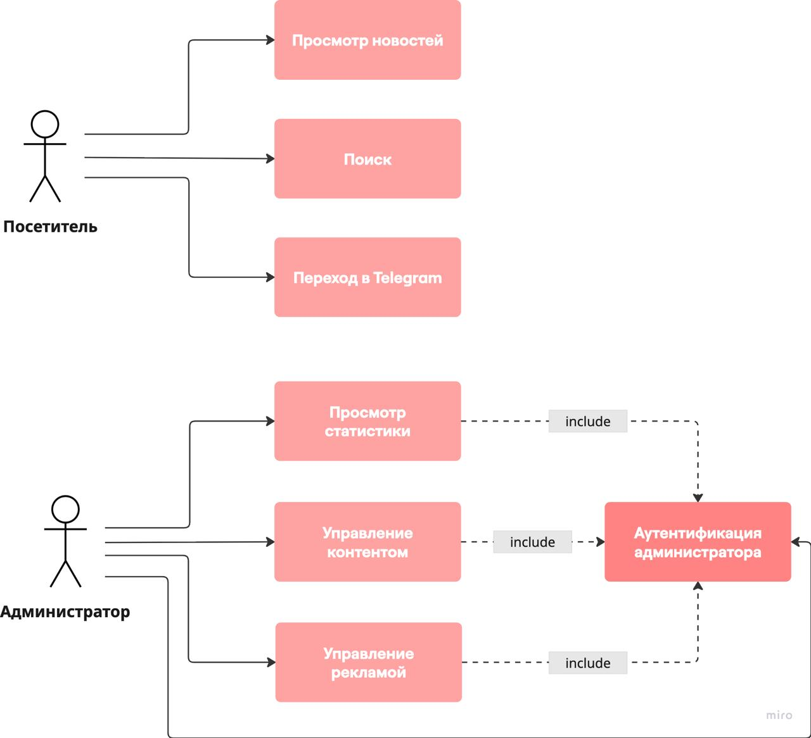

# Отчёт по лабораторной работе
## «Разработка требований к веб-сайту (SRS)»

### Вариант №408652  
**Сайт:** [prufy.ru](https://prufy.ru/)

---

## Software Requirements Specification (SRS)

### 1. Введение

#### 1.1. Цель документа
Документ содержит перечень требований к разрабатываемому веб-сайту, структурированных по категориям методологии RUP (Rational Unified Process). Публичная регистрация пользователей отсутствует; взаимодействие с посетителями осуществляется через Telegram.

#### 1.2 Область применения
Новостной интернет-портал, предоставляющий посетителям доступ к актуальным новостям (просмотр, поиск) и возможность связаться с редакцией через Telegram. Административная часть включает управление контентом, рекламой и аналитику.

---

### 2. Требования к системе

#### 2.1 Функциональные требования (F)

| ID | Название | Описание | Атрибуты (RUP) | Часы | Аргументация |
|----|----------|----------|----------------|------|--------------|
| **F-01** | Просмотр новостной ленты | Отображение списка новостей с пагинацией, фильтрацией по категориям и датам. | Приоритет: Высокий Риск: Низкий Стабильность: Высокая Статус: Разрабатывается | 40 | Базовая функция, требует реализации API, верстки карточек, фильтров. |
| **F-02** | Просмотр полной новости | Отображение заголовка, текста, изображений, даты, автора, счетчика просмотров. | Приоритет: Высокий Риск: Низкий Стабильность: Высокая Статус: Разрабатывается | 24 | Стандартная страница детального просмотра, интеграция с медиа-файлами. |
| **F-03** | Поиск по сайту | Поиск новостей по ключевым словам в заголовке и тексте с результатами в виде ленты. | Приоритет: Средний Риск: Средний Стабильность: Средняя Статус: Разрабатывается | 56 | Требуется настройка поискового индекса (Elasticsearch или полнотекстовый поиск SQL). |
| **F-04** | Управление контентом (админ-панель) | Авторизованный администратор может создавать/редактировать/удалять новости, загружать изображения, управлять категориями через защищенный интерфейс. | Приоритет: Высокий Риск: Средний Стабильность: Высокая Статус: Разрабатывается | 80 | Реализация WYSIWYG-редактора, медиа-менеджера, системы авторизации для администратора. |
| **F-05** | Управление рекламными местами | Возможность размещения рекламных баннеров в заданных позициях (шапка, сайдбар, внутри статьи) с настройкой периодов показа. | Приоритет: Средний Риск: Средний Стабильность: Средняя Статус: Разрабатывается | 60 | Интеграция с системой ротации баннеров, отслеживание показов/кликов. |
| **F-06** | Интеграция с Telegram | Отображение иконки-ссылки на Telegram-канал (или чат-бот) для связи с редакцией. Ссылка ведет на внешний ресурс. | Приоритет: Низкий Риск: Низкий Стабильность: Высокая Статус: Разрабатывается | 4 | Добавление элемента в шаблон, настройка URL. |

---

#### 2.2 Требования пользователей сайта (U)

| ID | Название | Описание | Атрибуты (RUP) | Часы | Аргументация |
|----|----------|----------|----------------|------|--------------|
| **U-01** | Интуитивная навигация | Меню с категориями, хлебные крошки, поисковая строка доступны на всех страницах. | Приоритет: Высокий Риск: Низкий Стабильность: Высокая Статус: Разрабатывается | 32 | Реализуется через единый шаблон. |
| **U-02** | Адаптивный дизайн | Корректное отображение на мобильных устройствах, планшетах и десктопах. | Приоритет: Высокий Риск: Низкий Стабильность: Высокая Статус: Разрабатывается | 48 | Использование CSS-фреймворка или медиазапросов, тестирование. |
| **U-03** | Скорость загрузки страниц | Время загрузки страницы не более 2 секунд при скорости интернета 10 Мбит/с. | Приоритет: Высокий Риск: Средний Стабильность: Высокая Статус: Разрабатывается | 40 | Оптимизация запросов, кэширование, CDN для изображений. |
| **U-04** | Доступность (Accessibility) | Соответствие WCAG 2.1 уровня A (контрастность, навигация с клавиатуры, alt-теги). | Приоритет: Средний Риск: Средний Стабильность: Высокая Статус: Разрабатывается | 36 | Требует аудита и доработки верстки. |

---

#### 2.3 Требования владельцев сайта (O)

| ID | Название | Описание | Атрибуты (RUP) | Часы | Аргументация |
|----|----------|----------|----------------|------|--------------|
| **O-01** | Аналитика и отчетность | Встроенная панель статистики: просмотры статей, источники трафика, активность пользователей (анонимная). | Приоритет: Высокий Риск: Средний Стабильность: Средняя Статус: Разрабатывается | 64 | Интеграция с сервисами аналитики или своя реализация, визуализация данных. |
| **O-02** | SEO-оптимизация | ЧПУ-URL, автоматические мета-теги, карта сайта sitemap.xml, микроразметка Schema.org. | Приоритет: Высокий Риск: Низкий Стабильность: Высокая Статус: Разрабатывается | 32 | Реализуется на уровне роутинга и шаблонов. |
| **O-03** | Управление правами доступа | Только администратор имеет доступ к админ-панели; возможность создания нескольких учетных записей администратора. | Приоритет: Высокий Риск: Высокий Стабильность: Высокая Статус: Разрабатывается | 40 | Защищенная аутентификация, управление администраторами (без ролей для пользователей). |
| **O-04** | Монетизация через рекламу | Возможность управления рекламными блоками без программиста (через админку). | Приоритет: Средний Риск: Низкий Стабильность: Средняя Статус: Разрабатывается | 40 | Реализуется как часть F-05 с интерфейсом для вставки кода. |

---

#### 2.4 Нефункциональные требования (N)

| ID | Название | Описание | Атрибуты (RUP) | Часы | Аргументация |
|----|----------|----------|----------------|------|--------------|
| **N-01** | Производительность | Система должна выдерживать 1000 одновременных пользователей с временем ответа API < 500 мс. | Приоритет: Высокий Риск: Высокий Стабильность: Высокая Статус: Разрабатывается | 80 | Требует нагрузочного тестирования, оптимизации БД, кэширования. |
| **N-02** | Безопасность | Защита от OWASP Top 10 (SQL-инъекции, XSS, CSRF), использование HTTPS, защита форм. | Приоритет: Высокий Риск: Высокий Стабильность: Высокая Статус: Разрабатывается | 72 | Реализация на уровне фреймворка, аудит безопасности, настройка SSL. |
| **N-03** | Надежность | Доступность 99.5% (плановая простота не более 3.5 часов в месяц), резервное копирование БД раз в сутки. | Приоритет: Высокий Риск: Средний Стабильность: Высокая Статус: Разрабатывается | 48 | Настройка инфраструктуры, автоматических бэкапов, мониторинга. |
| **N-04** | Масштабируемость | Архитектура должна позволять горизонтальное масштабирование (отделение БД, статики). | Приоритет: Средний Риск: Высокий Стабильность: Средняя Статус: Разрабатывается | 64 | Проектирование с учетом распределенной архитектуры. |

---

### 3. UseCase-диаграмма 

**Акторы:**
* **Посетитель** – любой пользователь без аутентификации.
* **Администратор** – владелец или назначенное лицо с доступом в защищенную панель управления.

**Прецеденты использования:**
1. **Просмотр новостей** – лента, фильтрация, детальная страница.
2. **Поиск** – поиск по контенту.
3. **Переход в Telegram** – нажатие на иконку приводит к внешнему ресурсу.
4. **Аутентификация администратора** – вход в админ-панель.
5. **Управление контентом** – создание, редактирование, удаление новостей, категорий, изображений.
6. **Управление рекламой**– настройка рекламных блоков.
7. **Просмотр статистики** – аналитика посещений.

---

### 4. Выводы по работе
В результате последовательного уточнения на основе анализа реального сайта был составлен документ SRS, полностью соответствующий его функциональности:

1. **Публичная часть** ограничена просмотром новостей, поиском и иконкой-ссылкой на Telegram. Это минимизирует разработку пользовательских сценариев и переносит взаимодействие с аудиторией во внешний сервис.
2. **Административная часть** сосредоточена на управлении контентом, рекламой и аналитике – ключевых для владельца сайта задачах.
3. **Общая оценка трудозатрат** (суммарно **~796 часов**) отражает преобладание сложности в нефункциональных требованиях (безопасность, производительность) и в реализации админ-панели, что типично для новостных порталов без пользовательского взаимодействия.
4. **UseCase-диаграмма** наглядно демонстрирует разделение: посетители имеют три простых прецедента, администратор – защищённые действия, объединённые общей аутентификацией.
5. **Методология RUP** и атрибутирование требований позволили гибко реагировать на уточнения заказчика (отсутствие регистрации, форма отправки новостей → Telegram) без потери структуры документа.

---

### 5. Вопросы к защите лабораторной работы
#### 1. Методологии разработки ПО. Унифицированный процесс

**RUP** – итеративная методология, разделяющая жизненный цикл на 4 фазы:  
*Начало*, *Уточнение*, *Конструирование*, *Передача*.  

Основные артефакты:  
- модель требований,  
- модель прецедентов,  
- архитектурная модель и др.  

Акцент на управление рисками и визуальное моделирование (UML).

#### 2. Требования и их категоризация. Атрибуты требований

Требования делятся на:
- **функциональные** (что система делает),
- **нефункциональные** (как система это делает),
- требования пользователей и владельцев.

В RUP каждое требование снабжается атрибутами:
- **приоритет** (High / Medium / Low),
- **риск** (High / Medium / Low),
- **стабильность** (High / Medium / Low),
- **статус** (Разрабатывается / Запланировано / Утверждено и др.).

Это помогает планировать итерации и контролировать выполнение.

#### 3. Язык UML

**Unified Modeling Language** – стандарт визуального моделирования, используемый для спецификации, конструирования и документирования программных систем.  

В работе использованы диаграммы прецедентов (UseCase), которые относятся к категории диаграмм поведения.

#### 4. Прецеденты использования. UseCase-диаграммы — состав, виды связей

**Прецедент** – последовательность действий, приводящая к результату, ценному для актора.

**Состав диаграммы:**
- **Акторы** 
- **Прецеденты** 
- **Границы системы** 

**Виды связей:**
- **Ассоциация** – между актором и прецедентом (сплошная линия).
- **Включение** (`<include>`) – прецедент обязательно вызывает другой (пунктирная стрелка).
- **Расширение** (`<extend>`) – прецедент может быть дополнен другим при определённом условии.
- **Обобщение** – наследование акторов или прецедентов.
